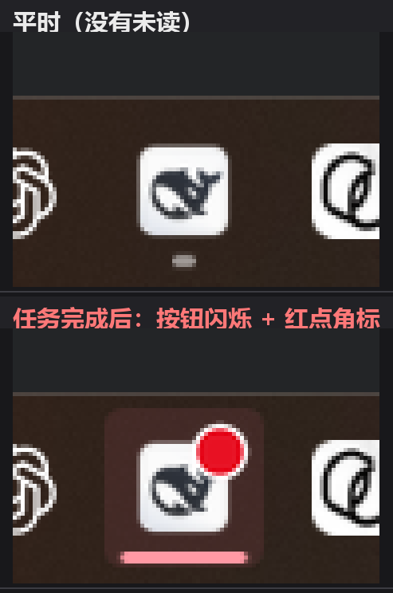

# dsh-task-notify

DeepSeek Harness 桌面端插件：**任务完成时发出提示音、闪烁任务栏图标、并在任务栏图标上叠加角标**；当你切回 DSH 窗口后，闪烁和角标自动消失。

> A DeepSeek Harness desktop plugin: plays a sound, flashes the taskbar button, and shows an overlay badge when a task finishes — and keeps doing so until you switch back to the DSH window.



## 功能

| 提示 | 实现方式 | 关闭条件 |
| --- | --- | --- |
| 🔔 提示音 | 渲染端播放 `assets/*.wav`；若渲染端没在轮询，则由宿主用 `Media.SoundPlayer` 兜底发声 | 播完 |
| ✨ 任务栏闪烁 | 外部常驻进程调用 Win32 `FlashWindowEx(FLASHW_ALL \| FLASHW_TIMERNOFG)`，并由看护线程**每 900ms 重新上发条** | 窗口进入前台 |
| 🔴 角标 | 外部常驻进程调用 `ITaskbarList3::SetOverlayIcon`，在任务栏按钮右上角画一个红点 / 绿勾 | 窗口进入前台（发通知时你本来就在窗口前的话，至少展示 `badgeMinMs`） |

即：**任务完成后一直闪、角标一直在，直到你把 DSH 切到前台。**

三者可以独立开关（见下方配置）。

## 为什么要用「外部进程」

DSH 桌面端把宿主运行在 `ELECTRON_RUN_AS_NODE=1` 的子进程里（`resources/app.asar` → `lib/main.js` 用 `spawn` 启动 `@deepseek-ai/dsh-desktop-host`），插件拿到的是 Node 环境，`require('electron')` 给不出 `BrowserWindow`；`preload-app.cjs` 暴露的 `dshDesktop` API 里没有 `flashFrame` / `setOverlayIcon`；`DESKTOP_IPC` 频道表里也没有任何任务栏相关通道。

所以本插件走**进程外 Win32**：`native/TaskbarNotify.cs` 编译成常驻小 exe，宿主通过 stdin/stdout 用纯文本协议指挥它。这样还有两个好处：

- `SetOverlayIcon` 的 `HICON` 必须由一个**一直活着**的进程持有，一次性进程退出后角标会失效；
- 常驻进程自己轮询 `GetForegroundWindow()`，不依赖渲染端脚本也能在你回到窗口时把角标清掉。

> 顺带一提：前端脚本必须用 `ctx.on('webserver/index-inject', ...)` 这条通道注入。桌面端的 `index.html` 由 Electron 主进程静态提供，`ctx.webServer.tapIndex()` 只在 `dsh web` 的 HTTP 渲染路径生效，在桌面端是死路。

## 安装

```powershell
# 1. 把仓库放到 DSH 的插件目录
git clone https://github.com/<your-name>/dsh-task-notify.git "$env:USERPROFILE\.dsh\plugins\dsh-task-notify"
```

2. 建目录联接，让 profile 能解析到这个包：

```powershell
New-Item -ItemType Junction `
  -Path   "$env:USERPROFILE\.dsh\profiles\desktop\node_modules\dsh-task-notify" `
  -Target "$env:USERPROFILE\.dsh\plugins\dsh-task-notify"
```

3. 编辑 `%USERPROFILE%\.dsh\profiles\desktop\package.json`：

- `dependencies` 里加 `"dsh-task-notify": "link:<插件绝对路径>"`
- `dsh.profile.bundles` 数组末尾加 `"dsh-task-notify"`

也可以直接用插件管理器：

```powershell
dsh plugin --profile desktop add link:C:\path\to\dsh-task-notify
```

装完**重启 DeepSeek Harness**生效——`cordis.yml` 是启动时按 bundles 顺序重新生成的，普通热重载不会新增 loader 行。

首次运行时插件会自动用 `csc.exe` 把 `native/TaskbarNotify.cs` 编译成 `native/bin/dsh-taskbar-helper.exe`（几百毫秒，之后缓存；`.cs` 改动后会自动重编）。

## 配置

配置文件：`%USERPROFILE%\.dsh\dsh-task-notify.json`（不存在则用默认值，首次改配置时写入）。

| 键 | 默认 | 说明 |
| --- | --- | --- |
| `enabled` | `true` | 总开关 |
| `soundEnabled` | `true` | 是否播放提示音 |
| `soundName` | `"chime"` | `chime` / `ding` / `pop` |
| `volume` | `0.7` | 0–1 |
| `flashEnabled` | `true` | 是否闪烁任务栏按钮 |
| `badgeEnabled` | `true` | 是否显示角标 |
| `badgeIcon` | `"dot"` | `dot`（红点）/ `check`（绿勾） |
| `badgeClearOnFocus` | `true` | 切回窗口后清除角标 |
| `badgeMinMs` | `1500` | 角标最短展示时长（发通知时窗口已在前台时至少露脸这么久） |
| `minTurnMs` | `0` | 本轮至少持续多久才算「一个任务」，过滤掉瞬时的碎回合 |
| `debounceMs` | `1500` | 静默期：已经有这么长时间没有任何会话活动，才判定「全部忙完了」 |
| `cooldownMs` | `2000` | 两次提醒之间的最小间隔 |

也可以运行时改。注意：**从外部 PowerShell 直接请求会被 DSH 的信任栅栏挡成 401**，要在 DSH 页面自己的开发者工具 console 里调用：

```js
await (await fetch('/dsh-task-notify/config')).json()                                     // 读
await fetch('/dsh-task-notify/config', { method: 'POST', body: '{"soundName":"pop"}' })   // 局部改
await fetch('/dsh-task-notify/test', { method: 'POST' })                                  // 立刻试一次提醒
```

## 触发逻辑

不是简单的 `turn/end` 就响——那样子代理和 workflow 每结束一个都会响一次。这里是**「全都忙完了」语义**：

- 任何 `session/event`（非 `turn/end`）、`api-session/status(running=true)`、`agent/status(status === "running")` 都只是刷新 `lastBusyAt`（忙标志）；
- `turn/end` 时记下 `pendingEnded` 并启动 `debounceMs` 的定时器；
- 定时器到点时若 `lastBusyAt` 还太新就再等一轮；否则检查 `minTurnMs` / `cooldownMs`，通过就响。

这样即使某个子代理的结束事件丢了、或者忙标志卡住，最多也只是延迟，不会永久哑掉。

## 文件结构

```
dsh-task-notify/
├── package.json          # dsh.bundle.patch -> ./cordis.patch.yml
├── cordis.patch.yml      # 向 profile 插入本插件
├── README.md
├── assets/
│   ├── chime.wav / ding.wav / pop.wav
│   ├── badge-dot.ico          # 16/24/32/48
│   └── badge-check.ico        # 16/24/32/48
├── docs/
│   └── preview.png            # 效果预览
├── native/
│   ├── TaskbarNotify.cs       # 常驻 Win32 助手（csc 编译）
│   └── bin/                   # 编译产物 dsh-taskbar-helper.exe
├── tools/
│   └── selfcheck.mjs          # mock ctx 离线自检
└── lib/
    ├── index.js          # 宿主插件：事件汇聚 + HTTP 路由 + index 注入 + 原生助手管理
    ├── native.js         # 编译/启动/重连 helper，stdin/stdout 协议
    └── client.js         # 注入渲染端：轮询事件、播音效、回报焦点
```

## 接口

宿主注册的 HTTP 路由（都走 DSH 的 `connection.requestRejection` 信任栅栏）：

| 路由 | 方法 | 说明 |
| --- | --- | --- |
| `/dsh-task-notify/client.js` | GET | 注入到页面的客户端脚本 |
| `/dsh-task-notify/events` | GET | `?since=<seq>` → `{ok, seq, serverTime, events:[{seq, type:'done'\|'error', ts}], config}` |
| `/dsh-task-notify/config` | GET/POST | 读/写配置，POST 走字段白名单 |
| `/dsh-task-notify/focus` | POST | 渲染端报告窗口获得焦点 |
| `/dsh-task-notify/soundfallback` | POST | 渲染端报告「播不出声」，请宿主兜底发声 |
| `/dsh-task-notify/test` | GET/POST | 立刻触发一次提醒 |
| `/dsh-task-notify/sound/<name>.wav` | GET | 音效文件 |

助手协议（宿主 → 助手 stdin）：`flash`、`stopflash`、`badge <ico绝对路径>`、`badgeclear`、`badgemin <ms>`、`focus`、`hwnd`、`ping`、`quit`；
（助手 → 宿主 stdout）：`START`、`READY <hwnd>`、`WINDOW <hwnd>`、`FOCUS <hwnd>`、`FOCUS explicit`、`BADGED`、`BADGECLEARED`、`FLASHING`、`FLASHSTOPPED`、`PONG`、`ERR <msg>`、`BYE`。

## 验证

**离线自检**（不需要 DSH 在跑，用 mock ctx 直接加载真实插件代码，23 项断言）：

```powershell
node tools/selfcheck.mjs
```

它会在过程中真的闪一下任务栏（因为走的是真实的原生助手），跑完自动恢复配置文件。

**装好后在运行中的 DSH 里验证**：随便让一个任务结束，应当听到提示音、任务栏按钮开始闪并出现红点；点回 DSH 窗口后角标消失。想立刻试，在页面 console 里 `await fetch('/dsh-task-notify/test', {method:'POST'})`。

## 已知限制

- 只支持 **Windows 桌面端**（`FlashWindowEx` / `ITaskbarList3` 都是 Win32 API）。macOS 需要改用 `app.dock.bounce()`，Linux 需要 `libunity` 的 LauncherEntry，目前都没做。
- 首次编译依赖 .NET Framework 自带的 `csc.exe`（`%WINDIR%\Microsoft.NET\Framework64\v4.0.30319\`）。找不到就会降级为「只有提示音」。
- 插件配置不支持热加载，改完要重启 DSH。
- 角标图标受 Windows 限制：不能超过 16×16 视觉尺寸，位图模式下只有透明 = 白色。

## 排障

- **没有提示音**：多半是渲染端脚本没被注入（检查宿主 console 的 `[dsh-task-notify]` 日志）。渲染端播放失败时它会主动调 `/soundfallback`，宿主改用 `Media.SoundPlayer` 兜底；轮询整个断了的话宿主也会自动兜底，所以听不到才是真的没发声。
- **任务栏没反应**：先看宿主 console 里 `[dsh-task-notify]` 的 `helper=` 是不是 `ready`；不是的话助手启动失败（编译不了 `TaskbarNotify.cs`，或找不到 DSH 主窗口）。
- **角标一闪而过**：调大 `badgeMinMs`。
- **子代理结束时也想响**：调小 `debounceMs`。
- **助手进程残留**：`Get-Process dsh-taskbar-helper`，父进程退出时它会自己结束（stdin EOF）。

## License

MIT